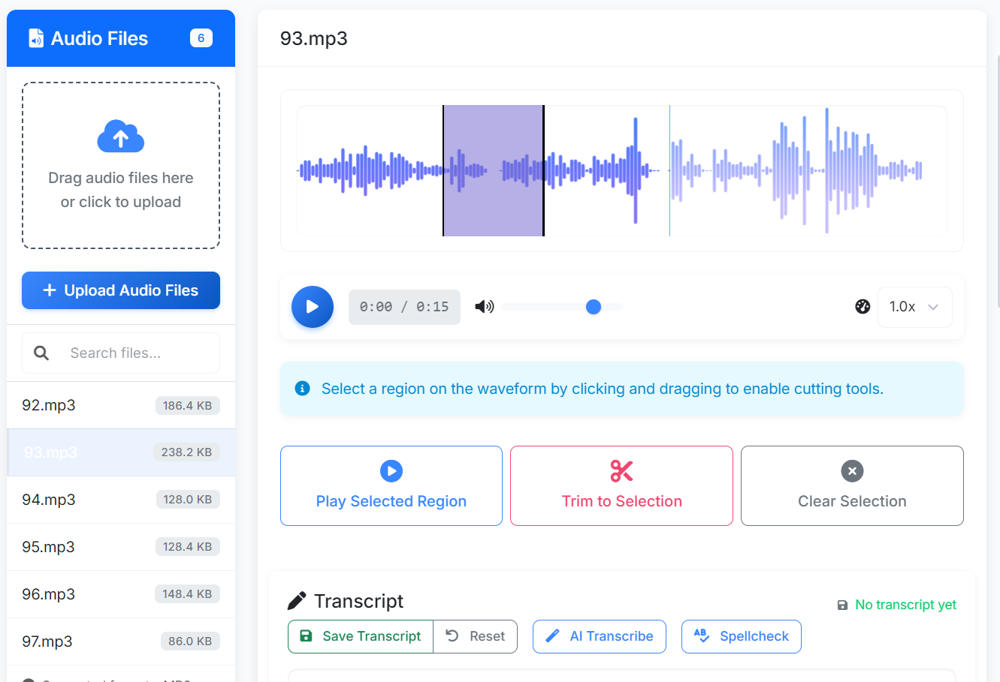
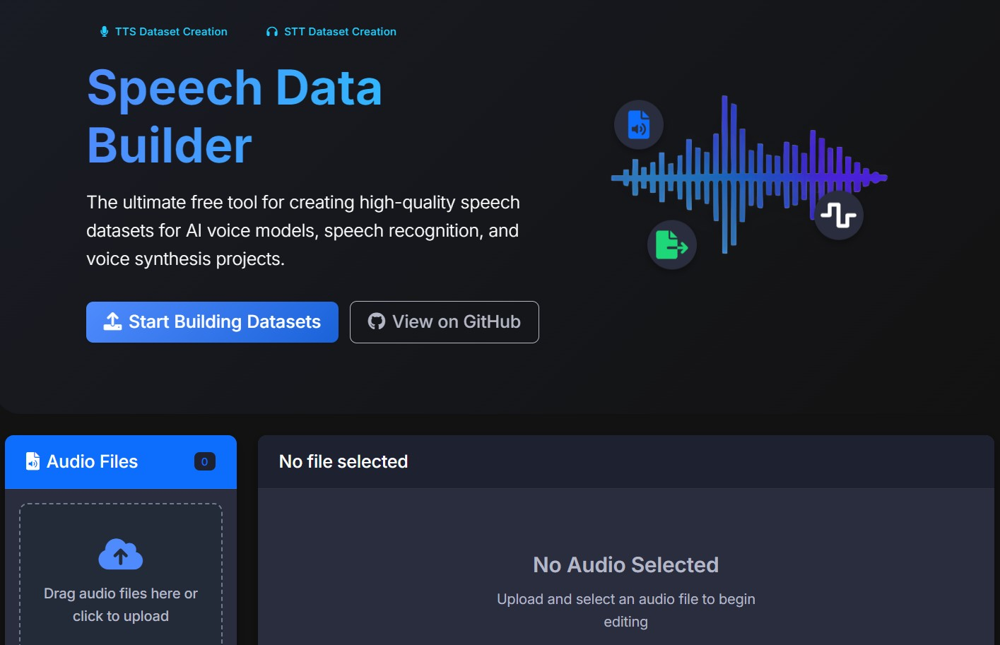

# Speech Data Builder: TTS & STT Dataset Creation Tool


## The Ultimate Free Tool for Creating High-Quality Speech Datasets

Speech Data Builder is a powerful, open-source web application designed to streamline the creation of professional speech datasets for Text-to-Speech (TTS) and Speech-to-Text (STT) model training. Whether you're developing voice assistants, speech recognition systems, or voice synthesis applications, this tool provides everything you need to build high-quality speech corpora.

## 🔥 Key Features

- **AI-Powered Transcription**: Automatically transcribe your audio files using state-of-the-art AI models from Google AI Studio and OpenAI.
- **Multiple Export Formats**: Export your datasets in popular formats including LJSpeech, Common Voice, and custom configurations.
- **Audio Visualization**: Precise waveform display with region selection for accurate transcript alignment.
- **Text Normalization**: Automatic text normalization for TTS model training with special handling for multiple languages.
- **Batch Processing**: Efficiently process multiple audio files in one go, saving time and effort.
- **Real-time Editing**: Edit transcripts with real-time saving and instant audio playback.
- **Customizable Settings**: Configure the tool to match your specific dataset requirements.
- **Dark Mode Support**: Work comfortably in any lighting conditions with our eye-friendly dark mode.

## 📊 Perfect For

- **ML Engineers**: Building custom voice models and speech recognition systems
- **Voice Assistant Developers**: Creating training data for voice assistants
- **Researchers**: Collecting and organizing speech data for linguistic research
- **Content Creators**: Transcribing podcasts, interviews, or educational content
- **Language Preservationists**: Documenting endangered languages and dialects

## 📸 Screenshots

### Light Mode



### Dark Mode



## 🚀 Getting Started

1. Open the application in your web browser
2. Upload your audio files (MP3, WAV, OGG, FLAC supported)
3. Use AI transcription or manually enter transcripts
4. Customize and normalize text as needed
5. Export in your preferred format

### Option 1: Use the Live Version

Visit [https://fs-17.github.io/SpeechDataBuilder](https://fs-17.github.io/SpeechDataBuilder) to start creating speech datasets immediately.

### Option 2: Run Locally

1. Clone this repository:

   ```
   git clone https://github.com/FS-17/SpeechDataBuilder.git
   ```

2. Open the index.html file in any modern browser:
   - Double-click the file
   - Or serve it using a local web server:
     ```
     npx serve
     ```

## 💡 Advanced Features

### LJSpeech Dataset Creation

Speech Data Builder excels at creating datasets in the popular LJSpeech format, widely used for training TTS models. The tool automatically:

- Normalizes text (converting numbers to words, removing special characters)
- Handles non-Latin scripts with specialized normalization
- Generates properly formatted metadata files

### AI Integration

Connect with leading AI services to automate the transcription process:

- **Google AI Studio**: Leverage the latest Gemini models (including 2.5 Pro and Flash) for accurate transcription
- **OpenAI**: Utilize Whisper and GPT models for speech recognition and text normalization

## 📝 Speech Dataset Creation Guide

### Step 1: Add Audio Files

- Click the "Upload Audio Files" button or drag and drop audio files onto the upload area
- Supported formats: MP3, WAV, OGG, FLAC
- Organize your speech samples for efficient processing

### Step 2: Transcribe Audio for Speech Recognition

- Select a file from the list to load it in the editor
- Use the audio playback controls to listen to the speech
- Type the accurate transcript in the transcript editor
- For TTS datasets, ensure proper punctuation and formatting
- Click "Save Transcript" or use Ctrl+S to save

### Step 3: Export Speech Dataset

- Navigate to the "Export Dataset" tab
- Choose your preferred format (LJSpeech, CSV, JSON, TXT)
- For TTS datasets: LJSpeech format includes normalized text
- For STT datasets: CSV or JSON provide flexible options
- Optionally include audio files in the export
- Click "Export Dataset" to download your speech data

## ⌨️ Keyboard Shortcuts for Fast Dataset Creation

| Shortcut   | Action                            |
| ---------- | --------------------------------- |
| Space      | Play/Pause audio                  |
| ← / →      | Skip back/forward 1 second        |
| A / D      | Skip back/forward 5 seconds       |
| W / S      | Increase/decrease playback speed  |
| R          | Create region at current position |
| Ctrl+S     | Save transcript                   |
| Ctrl+Alt+T | Toggle dark/light theme           |

## 📋 Speech Dataset Export Formats

### LJSpeech Format (Popular for TTS)

```
filename|transcript text|normalized text
```

### CSV Format (Flexible for STT)

```
FileName,Transcript
file1.wav,"This is the transcript for file one."
```

## 🤖 AI-Assisted Speech Transcription

SpeechDataBuilder supports AI-powered transcription to speed up dataset creation:

1. Navigate to the Settings tab
2. Select your preferred AI service provider
3. Enter your API key
4. Return to the transcription editor and click "AI Transcribe"
5. Edit the AI-generated transcript for perfect accuracy
6. Create large speech datasets in less time

## 🌐 Browser Compatibility

SpeechDataBuilder works in all modern browsers for cross-platform speech dataset creation:

- Chrome (recommended)
- Firefox
- Edge
- Safari

## 👥 Contributing to SpeechDataBuilder

Contributions are welcome! Help improve this open-source speech dataset tool:

1. Fork the repository
2. Create your feature branch (`git checkout -b feature/amazing-feature`)
3. Commit your changes (`git commit -m 'Add some amazing feature'`)
4. Push to the branch (`git push origin feature/amazing-feature`)
5. Open a Pull Request

## 📝 License

This project is licensed under the MIT License - see the LICENSE file for details.

## 🙏 Acknowledgments

- [WaveSurfer.js](https://wavesurfer-js.org/) for audio visualization
- [Bootstrap](https://getbootstrap.com/) for UI components
- [Font Awesome](https://fontawesome.com/) for icons
- [JSZip](https://stuk.github.io/jszip/) for file export capabilities

## 🔧 Technical Details

Speech Data Builder runs entirely in your browser with no server-side processing, ensuring your audio data remains private and secure. Built with modern web technologies:

- JavaScript ES6+
- WaveSurfer.js for audio visualization
- Bootstrap 5 for responsive design
- IndexedDB for client-side storage

## 📞 Contact

For questions, feedback, or support, please [open an issue](https://github.com/FS-17/SpeechDataBuilder/issues) on our GitHub repository.

---

**Speech Data Builder** — Making voice dataset creation accessible to everyone.

\_Keywords: TTS dataset, STT dataset, speech recognition data, voice dataset creator, LJSpeech format, speech corpus, AI voice training

## What’s new (Sep 2025)

- Import workflow: the ability to import existing datasets in LJSpeech, CSV, JSON, or TXT formats
- Update gemini model references to include latest versions
- Offline support (PWA): installable app with cached core assets for offline work
- Keyboard shortcuts: Space, ←/→, A/D, W/S, R, Ctrl+S, Ctrl+Alt+T
- Accessibility: Skip link to main content, improved focus outlines
- SEO: Correct canonical link and updated social sharing image

### Install as an app (optional)

Open the site in Chrome/Edge and use “Install app” from the address bar. Works offline after first load.
